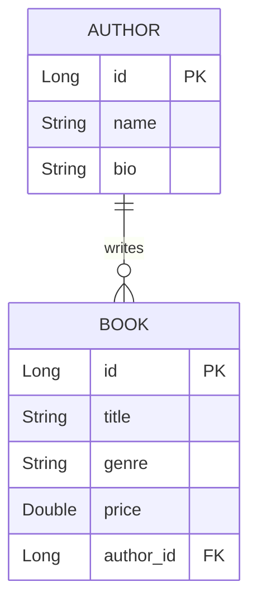

# Project Submission: Library Management System 📚

**Author:** Ayush Singh  
**GitHub URL:** [https://github.com/ayushsingh199/Spring-Boot-Library-Management](https://github.com/ayushsingh199/Spring-Boot-Library-Management)

---

## 1. Entity Relationship Design
The system manages two primary entities with a **One-to-Many** relationship:
- **Author**: Master entity with `id`, `name`, and `bio`.
- **Book**: Transactional entity with `id`, `title`, `genre`, `price`, and a foreign key `author_id`.



---

## 2. Implementation Details

### A. Create Operation
- **Form**: Implemented in `form.jsp` using JSTL to bind the `Book` object.
- **Controller**: `saveBook()` method in `LibraryController`.
```java
@PostMapping("/save-book")
public String saveBook(@ModelAttribute("book") Book book, Model model) {
    try {
        libraryService.saveBook(book);
        return "redirect:/";
    } catch (Exception e) {
        model.addAttribute("error", "Error saving book: " + e.getMessage());
        return "form";
    }
}
```
*(Insert screenshot of Add Book form here)*

### B. Read Operation
- **Listing**: All books are displayed in `list.jsp`.
- **Inner Join**: Optimized data fetching in `BookRepository`.
```java
@Query("SELECT b FROM Book b INNER JOIN b.author a")
List<Book> findAllBooksWithAuthors();
```
*(Insert screenshot of Book List here)*

### C. Update Operation
- **Functionality**: Reuses the form logic but pre-fills data using the existing entity ID.
- **Controller**:
```java
@GetMapping("/edit-book/{id}")
public String showEditBookForm(@PathVariable Long id, Model model) {
    Book book = libraryService.getBookById(id);
    model.addAttribute("book", book);
    return "form";
}
```
*(Insert screenshot of Edit Book form here)*

---

## 3. Challenges Faced & Solutions
1.  **JSP Configuration**: Spring Boot 3 uses Jakarta namespaces. I had to ensure the correct `jakarta.servlet.jsp.jstl` dependencies were used in `pom.xml`.
2.  **N+1 Query Issue**: Initially, fetching books caused multiple queries for authors. I resolved this using an `INNER JOIN` in the JPA Repository.

---

## 4. Github URL
[https://github.com/ayushsingh199/Spring-Boot-Library-Management](https://github.com/ayushsingh199/Spring-Boot-Library-Management)

---
**How to export to PDF:**
1. Open this file in VS Code or any Markdown editor.
2. Use "Export to PDF" or open the `SUBMISSION.html` file and print to PDF.
